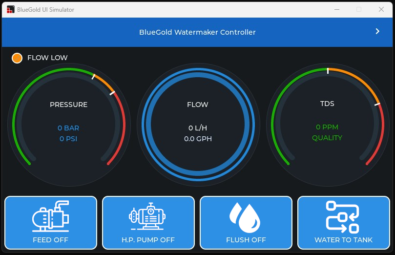
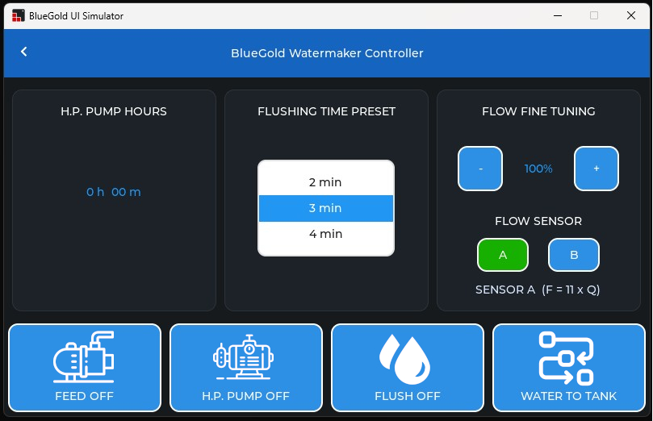

# N.E.R.D. – Watermaker Controller
> Smart embedded control for marine watermakers

**N.E.R.D. = Nautical Embedded Resource Director**

An embedded control system for marine watermakers, based on ESP32 architecture with touchscreen UI and modular RS485 communication.

---

## What this project does

The N.E.R.D. Watermaker Controller provides real-time control and monitoring of a marine reverse osmosis system.

It allows you to:

- Control feed pump and high-pressure pump
- Manage flushing cycles
- Switch between tank and test modes
- Monitor flow, pressure and TDS in real time
- Track pump runtime (persistent)
- Adjust system parameters via touchscreen

The system is designed for **reliability, simplicity and transparency**.

---

## System Architecture

The system is built using two microcontrollers:

### ESP32-S3 (Main Controller)

- 4.3" touchscreen display (800x480)
- LVGL 8.4 user interface
- Full system logic
- RS485 Modbus Master
- Sensor processing
- UI management

### ESP32-C3 (Remote Module)

- Modbus RTU Slave
- Flow pulse counting
- Analog input expansion (TDS, pressure)
- Relay control interface

---

## Communication

- Protocol: Modbus RTU
- Bus: RS485
- ESP32-S3 = Master
- ESP32-C3 = Slave

---

## User Interface

### Main Screen
- Pressure gauge (BAR / PSI)
- Flow gauge (L/h / GPH)
- TDS gauge (PPM)
- System status
- Control buttons:
  - Feed Pump
  - H.P. Pump
  - Flush
  - Mode (Tank / Test)

### Settings Screen
- H.P. pump runtime
- Flush preset
- Flow fine tuning
- Sensor configuration

---

## Screenshots

  

---

## Hardware

Typical setup:

- ESP32-S3 4.3" Touch Display
- ESP32-C3 module (RS485)
- RS485 relay board (Modbus)
- MAX3485 TTL to RS485 interface module
- RS485 analog acquisition module (for pressure and TDS)
- Flow sensor (pulse output)
- Pressure sensor (0–5V | 0-100 BAR)
- TDS sensor (Arduino TDS Meter V 1.0)

---

## Firmware Structure

firmware/
  S3_Controller/
  C3_Module/

---

## Requirements

### Software

- Arduino IDE
- ESP32 board package by Espressif (Arduino core)

### Libraries

- **LVGL 8.4.x (REQUIRED)**
- ESP32_Display_Panel
- ESP32_IO_Expander
- esp-lib-utils

⚠️ This project is NOT compatible with LVGL 9.

---

## Features

- Stable LVGL UI (no blocking)
- Round-robin sensor polling
- Optimized Modbus communication
- Persistent runtime storage
- Modular architecture

---

## Project Status

**Version: v1.0.0**

- Stable
- Long-run tested
- No critical crashes
- Ready for real-world usage

---

## Design Philosophy

- Non-proprietary components
- Industrial reliability
- Cost efficiency
- Full transparency

---

## License

This project is released for **non-commercial use only**.

See LICENSE file for details.

---

## 🌊 N.E.R.D. Ecosystem

This project is part of:

**N.E.R.D. – Nautical Embedded Resource Director**

A modular embedded system platform for marine applications.

---

## Contributing

Contributions and improvements are welcome.

---

## Note

Built by nerd sailors, for nerd sailors.
